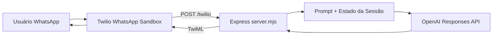

# Arquitetura

Este projeto implementa um bot de atendimento para clínica com dois pontos de entrada:

1. **CLI local** (`chat.mjs`) para simulação rápida.
2. **Webhook HTTP** (`server.mjs`) para integração com Twilio.

## Visão geral

## Componentes

- **`server.mjs`**: endpoint `/twilio`, sessão por usuário e resposta TwiML.
- **`chat.mjs`**: interface de terminal para validar conversas sem Twilio.
- **`clinica.json`**: base de conhecimento da clínica (serviços, horários, políticas).

## Decisões técnicas

- **JSON Schema** na resposta do modelo para previsibilidade do parsing.
- **State machine simples** para controlar coleta de agendamento.
- **Fallbacks determinísticos** quando o modelo não devolve a pergunta esperada.
