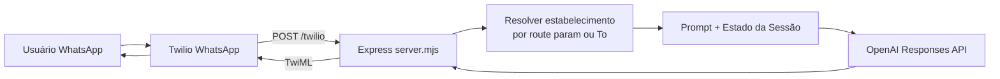

# Arquitetura (multi-estabelecimento)

Este projeto implementa um bot de atendimento para múltiplos estabelecimentos com dois pontos de entrada:

1. **CLI local** (`chat.mjs`) para simulação rápida.
2. **Webhook HTTP** (`server.mjs`) para integração com Twilio.

## Visão geral

## Componentes

- **`server.mjs`**: endpoint `/twilio`, resolução de estabelecimento, sessão por `establishmentId:from`, resposta TwiML.
- **`chat.mjs`**: interface de terminal com seleção por `ESTABLISHMENT_ID`.
- **`src/core/establishments.mjs`**: carga e resolução de estabelecimento.
- **`establishments.json`**: base de conhecimento de múltiplos estabelecimentos.

## Decisões técnicas

- **JSON Schema** na resposta do modelo para previsibilidade do parsing.
- **State machine simples** para controlar coleta de agendamento.
- **Sessão segmentada por estabelecimento** para evitar vazamento de contexto entre operações.
