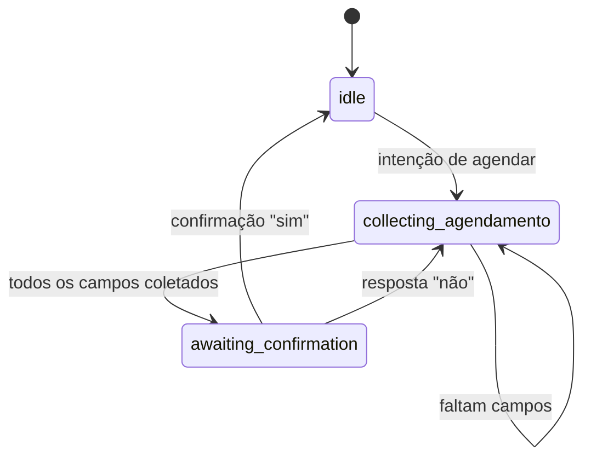

# Fluxo de conversa

O bot usa três estados principais:

- `idle`
- `collecting_agendamento`
- `awaiting_confirmation`

## Diagrama de estados

## Campos obrigatórios para agendamento

1. procedimento
2. data
3. horário
4. nome
5. telefone

## Regras de atendimento

- Não inventar dados fora do `clinica.json`.
- Fazer no máximo uma pergunta por vez durante coleta.
- Oferecer encaminhamento humano quando necessário.
